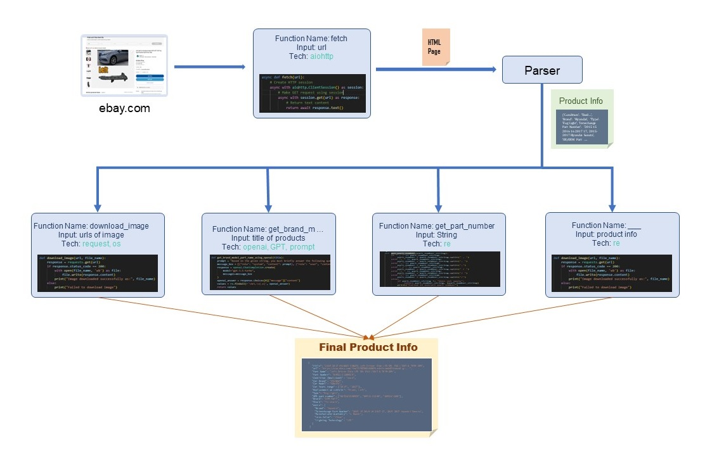
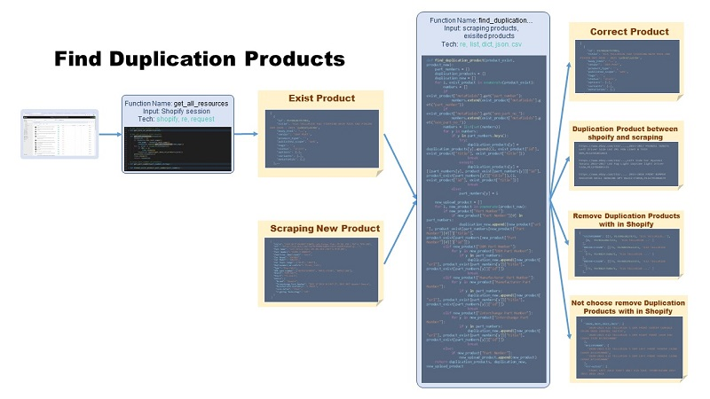
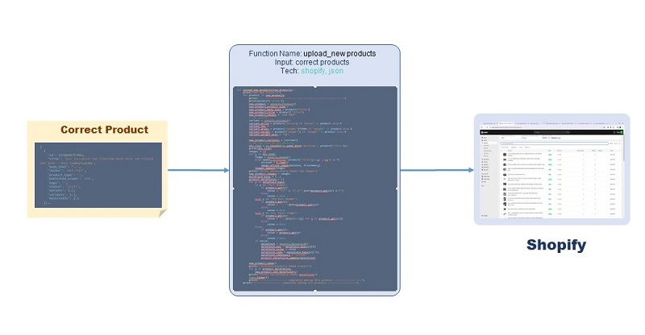
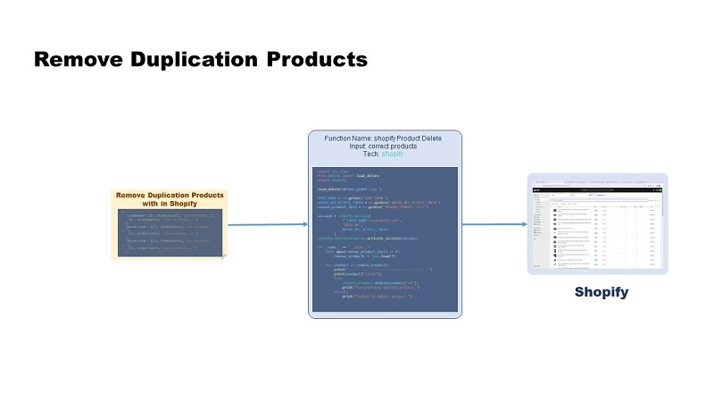

# ***Shopify Product Management*** 

This Project extracts products from [ebay.com](https://www.ebay.com/), and clean/organize their deatiled info. And finally, this upload these data on Shopify for [tryeparts.com](https://tryeparts.com/).

## Main Architecture

This project has 4 main components.

## 1. Web Scraping

'Web Scarping' Components is to extract products data and pictures from Ebay website.

#### Dialogflow

#### Usage
1)  Install Python and Python libraries

        pip install -r requirements.txt

2)  Set env file

        openai = sk-****************************************
        xlsx_file = List.xlsx
        SCRAP_PRODUCTS = scraping_products.json  # products which are scraped from ebay site

3)  Run

        python ebay_scraper.py

## 2. Shopify Data Entry

'Shopify Data Entry' Component is to do following tasks:
### 1. Finding duplication products       
Find duplicate products between Shopify and new products, and within Shopify

#### Dialogflow

#### Usage
1) Install Python and Python libraries

        pip install -r requirements.txt

2) Add env file

        SHOP_NAME = myshopify
        ADMIN_API_ACCESS_TOKEN = shpat_*******************************
        NEW_CHECKED_PRODUCT = new_upload_product.json  # products which all data is correct
        DUPLICATION_NEW_PRODCUT = duplication_new.csv  # duplication products between shopify and new products        

        REMOVE_PRODUCT_LIST = remove_product_list.json # remove duplication products with in shopify
        ADMIN_HANDLE_PRODUCT_LIST = admin_handle_product_list.json # duplicate products within Shopify, but it is difficult to select the product to delete

3) Run

        `python shopify_data.py`

### 2. Upload new products

#### Dialogflow

#### Usage
1) Run

        `python shopify_add_products.py`

### 3. Delete duplication products

#### Dialogflow

#### Usage
1) Run

        `python shopify_delete_products.py`

### 3. AI Generator for candidates list

'AI Generator' Components is to find candidate products on eBay based on administrator descriptions and generate a list of candidate products.

### 4. App Interface

This is GUI for administrator