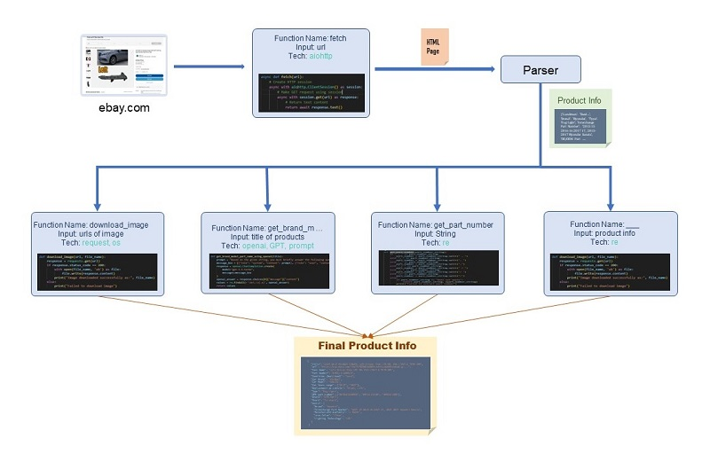

# ***Shopify Product Management*** 

This Project extracts products from [ebay.com](https://www.ebay.com/), and clean/organize their deatiled info. And finally, this upload these data on Shopify for [tryeparts.com](https://tryeparts.com/).

## Main Architecture

This project has 4 main components.

### 1. Web Scraping

'Web Scarping' Components is to extract products data and pictures from Ebay website.

#### Dialogflow

### Usage
1)  Install Python and Python libraries

        pip install -r requirements.txt

2)  Set env file

        openai = sk-****************************************
        xlsx_file = List.xlsx

3)  Run

        python ebay_scraper.py

### 2. Shopify Data Entry

'Shopify Data Entry' Component is to do following tasks:
1. Update/Upload extracted data on Shopify
    -   Compare extracted data with existing data to find missing/error values and update them
    -   Confirm there are no duplication products
    -   Upload Products on Shopify
2. Add search items
    -   Find search items as possible
    -	Add new search items

### 3. AI Generator for candidates list

'AI Generator' Components is to find candidate products on eBay based on administrator descriptions and generate a list of candidate products.

### 4. App Interface

This is GUI for administrator